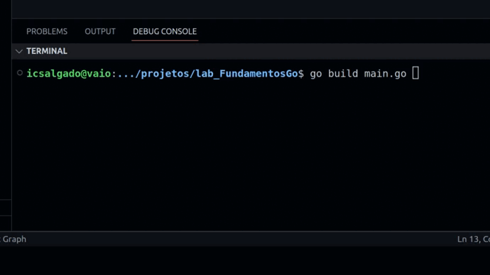

# Lab Project - GO Fundamentals

 <a href=""> Project Certificate</a> -
<a href="">Course Certificate</a> -
<a href="" target="_blank">Challenge</a>

 

                    
                    

## Goal

> To test the basic skills in golang, a sofware was proposed that converts the boiling point of water from Celcius to Kelvin. I did the conversion that any value entered by the user.

### The Project

### References
https://www.digitalocean.com/community/tutorials/how-to-use-variables-and-constants-in-go-pt